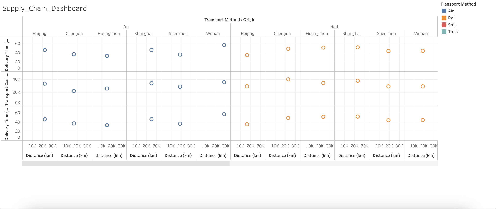

# 📦 Project 2: Supply Chain Dashboard

This project demonstrates supply chain data processing and visualization using cloud tools and cross-platform collaboration.

---

## 📊 Overview

The goal of this project is to analyze supplier and product performance based on a simulated order dataset. It includes:

- Cleaning raw supply chain order data with Python (Google Colab)
- Visualizing insights through Tableau Public
- Executing SQL queries using SQLFiddle (MySQL 5.6)

---

## 🧼 Data Cleaning (Python via Google Colab)

The original dataset was cleaned using Python in Google Colab.  
Cleaning steps included:
- Handling null values
- Removing duplicate records
- Standardizing date formats
- Exporting `cleaned_supply_orders.csv` for visualization and SQL query

🔗 [Colab Notebook Link](https://colab.research.google.com/drive/14xYDYSa90cUVil0eGwcW7EgnkBmTVQCa)

---

## 📈 Tableau Dashboard

Using the cleaned dataset, the following Tableau dashboard was created:

📌 [View Supply Chain Dashboard](https://public.tableau.com/app/profile/zheng.lyu6601/viz/SupplyChainDashboard_17487579608020/SupplyChainDashboard#2)

Includes:
- Total order quantity by product
- Supplier-wise shipment comparison
- Monthly order trend

🖼️ Sample Preview:  

---

## 🧠 SQL Practice (via SQLFiddle)

To showcase multi-tool proficiency, SQL queries were also performed using SQLFiddle (MySQL 5.6):

🔗 [SQLFiddle Execution Link](https://sqlfiddle.com/mysql/online-compiler?id=1b567ad2-8eff-44dc-a9a5-b3e7dad7eebe)

SQL logic includes:
- Table creation
- Simulated supplier data insertion
- Ranking suppliers by total quantity

🖼️ SQL Query Result:  

---

## 🌐 Cross-Platform Capabilities

| Tool | Platform |
|------|----------|
| Python | Google Colab |
| Visualization | Tableau Public |
| SQL Queries | SQLFiddle (MySQL 5.6) |

This cloud-based pipeline demonstrates real-world analytical workflows without relying on any local development environment.

---

## 📓 Notebook Format Notice

Due to GitHub rendering constraints, the Jupyter Notebook file retains the default name `Notebook.ipynb`. This does not affect functionality or reproducibility. All project steps are contained in the notebook.

---

📅 *Last updated: 2025-05-31*
