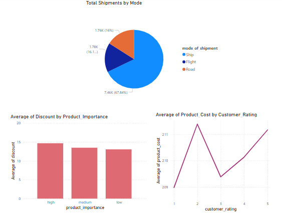
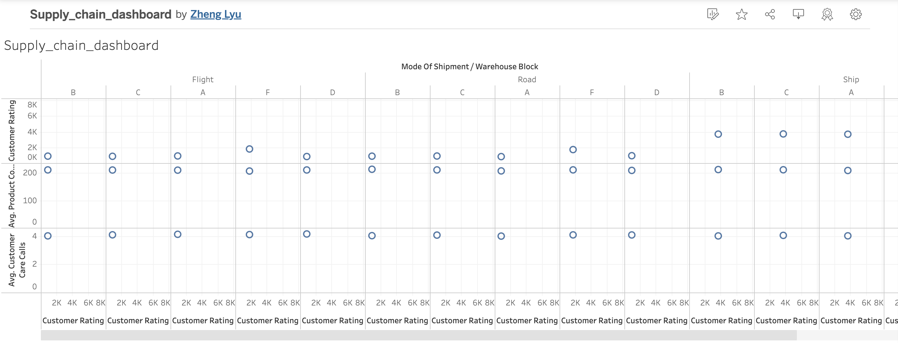

## 📊 Supply Chain Efficiency Dashboard

This project analyzes supply chain and logistics transaction data to uncover delivery performance patterns, cost structures, and customer behavior. It combines Python, SQL, Tableau, and Power BI to perform real-world data cleaning, operational insights extraction, and dashboard building. The project is tailored for showcasing technical competency in data roles such as analyst or BI developer.

---

## 🗂️ Project Structure

```
02_supply_chain_efficiency_dashboard/
├── data/
│   ├── supply_chain_raw.csv               # Original raw dataset
│   └── supply_chain_cleaned.csv           # Cleaned dataset used for analysis
├── scripts/
│   ├── supply_chain_dataset.sql           # SQL Data extraction & transformation script
│   └── supply_chain_dataset.python        # Python data cleaning script
├── dashboard/
│   ├── supply_chain_dashboard.pbix        # Power BI dashboard file
│   ├── powerbi_dashboard.pbix.png         # Power BI dashboard preview image
│   ├── supply_chain_dashboard.twbx        # Tableau workbook
│   └── tableau_dashboard.preview.png      # Tableau dashboard preview image
└── README.md
```

---

## 📥 Dataset Source

This project is based on the [Customer Analytics Dataset](https://www.kaggle.com/datasets/prachi13/customer-analytics) from Kaggle.  
It simulates supply chain and delivery data including product importance, discounts, customer ratings, and shipping costs.

--- 

## 🧹 Data Cleaning

Performed in both SQL (SQLite) and Python (pandas):

- Removed missing or invalid entries
- Renamed columns for consistency
- Verified value ranges for all key metrics
- Final cleaned file: `supply_chain_cleaned.csv`

---

## 🔍 Key Insights

- 🚚 Shipment via ship is the most common mode (over 67%)
- 🏭 High importance products receive greater average discounts
- 📈 Higher customer ratings correlate with increased product costs
- 📞 Rating 2 customers require the least customer care interaction

---

## 📈 Power BI Dashboard

📁 File: `supply_chain_dashboard.pbix`  
📷 Preview:  


**Includes:**

- Shipment mode distribution (pie chart)
- Average discount by product importance (bar chart)
- Average product cost by customer rating (line chart)

> Open `.pbix` using Power BI Desktop to explore the interactive visuals.

---

## 📊 Tableau Dashboard

📁 File: `supply_chain_dashboard.twbx`  
📷 Preview:  


**Includes:**

- Shipment count by transport mode (bar chart)
- Average product cost by warehouse block (bar chart)
- Average customer care calls by customer rating (bar chart)

> Open `.twbx` using Tableau Public (free) or Tableau Desktop 2022.1+.

---

## 🛠️ Tools Used

- Python: Pandas, Numpy, Matplotlib 
- SQL: SQLite used for querying relational datasets
- Microsoft Power BI: Built interactive dashboards and visual analytics
- Tableau Public: Alternative BI tool for dashboard comparison
- Google Colab/Github: For cloud-based development and collaboration 

---

## 📬 Contact

Feel free to live Tableau/Power BI links or collaboration requests, feel free to reach out via likendin https://www.linkedin.com/in/zheng-lyu-951295323/.
